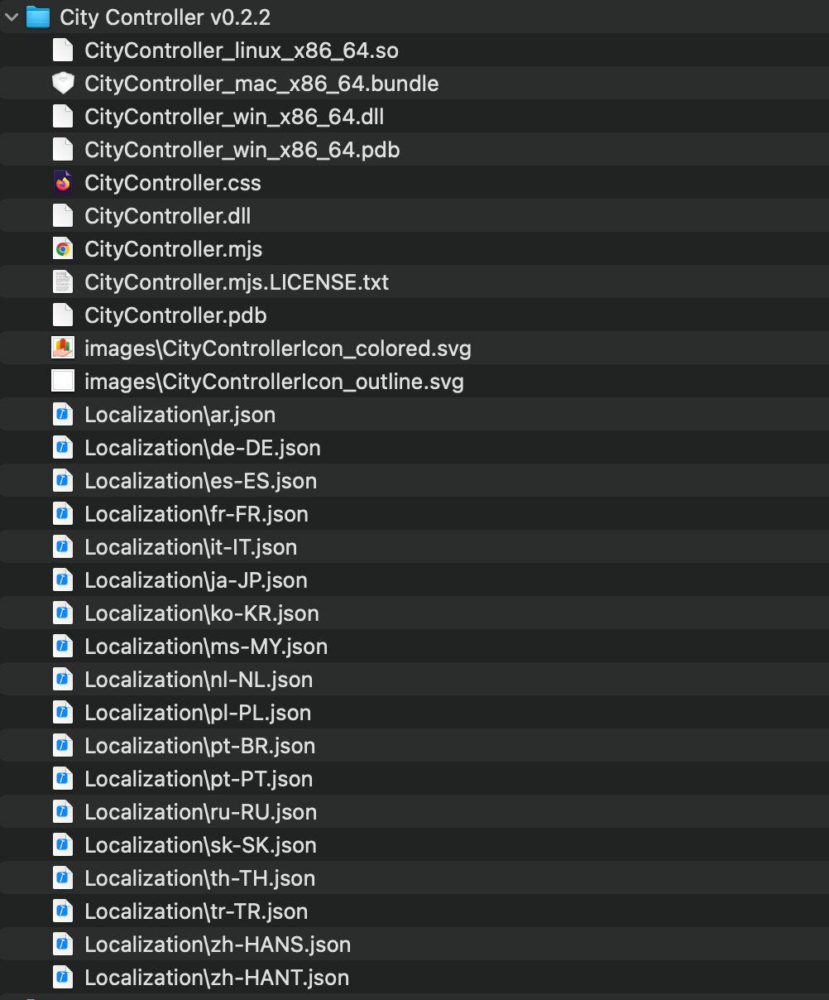
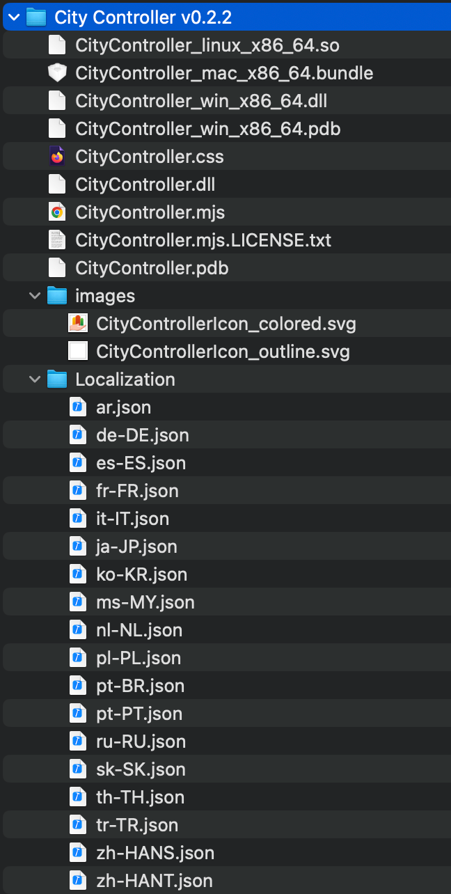

# cs2-pdxmods2wine
Small utility to fix the paths and names of the assets inside all the mods directory

When you download a mod from PDX Mods the file structure would look like this:



And after running the script it would look like this:

cture would look like this:



## How to run
``` python
python pdx2wine.py <path/to/mods/directory>
```